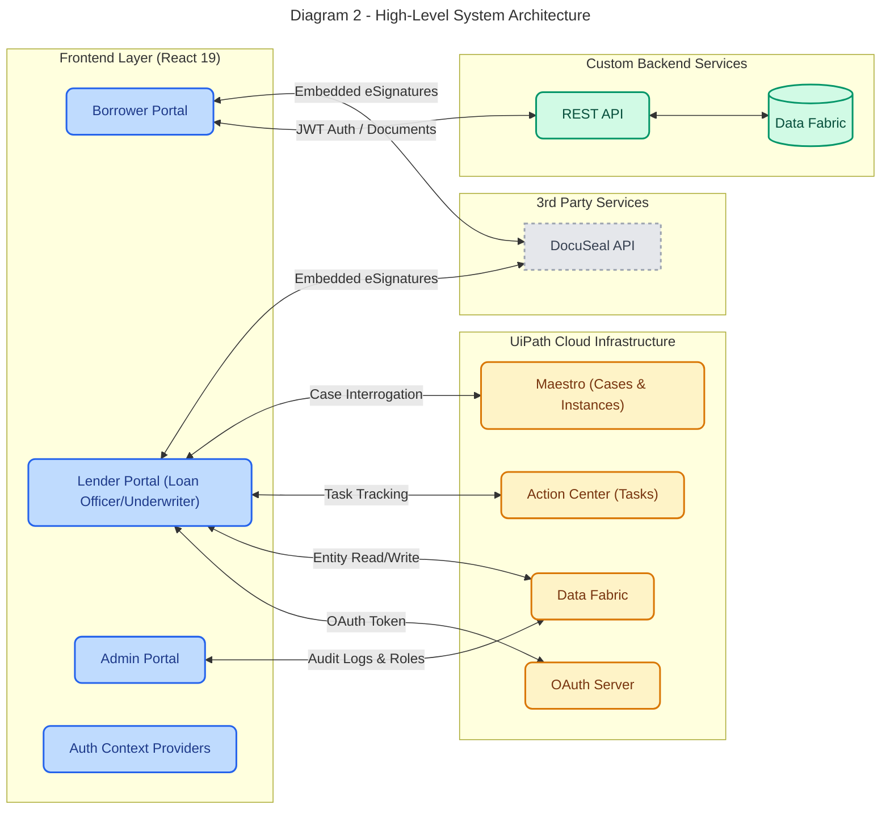

# Development Handoff Notes

## What this repo is doing

This is not just a frontend theme or demo. It is the UI for a lending workflow that depends on:

- a custom backend API
- UiPath OAuth
- UiPath Data Service entities
- UiPath Cases/Tasks
- DocuSeal for signatures

So when developing new features, always check whether the source of truth is:

1. backend REST API,
2. UiPath Data Service,
3. case/task workflow state,
4. uploaded documents.

### High-Level System Architecture Reference

For quick mental mapping, here is how the frontend pieces connect to these external systems:

*(Note: Install the Markdown Preview Mermaid Support extension in VS Code to view this diagram natively)*

---

## Practical onboarding checklist for you

### 1. First understand current runtime dependencies

Confirm these before building new features:

- backend API is reachable
- UiPath OAuth app is configured correctly
- redirect URI matches environment
- required Data Service entities exist
- case workflow ids/stages are valid
- DocuSeal backend endpoints are working

### 2. Treat status strings as critical business logic

Much of the UI behavior depends on exact text matches like:

- `Submitted`
- `Documents Reupload`
- `Agreement Sign Pending`
- `Agreement Approved`
- `UNDERWRITER_REVIEW`

Before changing anything, map every status used by frontend and backend.

### 3. Be careful with storage

- borrower session → `localStorage`
- UiPath session → `sessionStorage`

Debugging login/logout issues requires checking both.

### 4. Watch for casing differences in entity fields

The code already compensates for inconsistent field names like:

- `loanAmount` vs `LoanAmount`
- `caseStatus` vs `CaseStatus`
- `userId` vs `UserId`

This means upstream data is not perfectly normalized.

---

## Recommended first tasks when you start actively developing

### Safe tasks

- add centralized TypeScript interfaces for entity shapes
- create constants for routes, statuses, entity names
- document API contract assumptions
- add logging wrappers around UiPath SDK operations
- add error boundary / user-facing error states

### Risky tasks

- changing authentication flow
- renaming status values
- modifying route parameter structure
- changing document signing endpoints
- altering Data Service entity names/field names

---

## Most important technical debt items

1. status normalization
2. mixed backend + UiPath data ownership
3. inconsistent env var naming
4. commented legacy code still present in pages
5. thin typing with many `any` usages
6. empty or partially used modules such as `src/api/lender/get.ts`

---

## Suggested future documentation to add later

- full route matrix with screenshots
- entity schema reference from UiPath
- backend API contract reference
- sequence diagrams for borrower/officer/underwriter flows
- deployment and environment setup guide

---

## Short owner’s summary

If something breaks, ask these questions in order:

1. Is the user authenticated in the right system?
2. Is the data coming from REST or UiPath?
3. Is the expected status string exactly matching?
4. Is the related case/document already created upstream?
5. Is the UI reading the correct route params and entity fields?

That mental checklist will save a lot of time in this codebase.