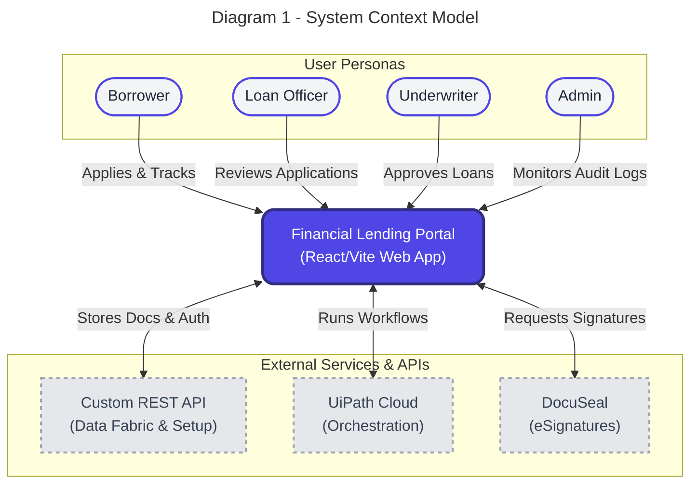
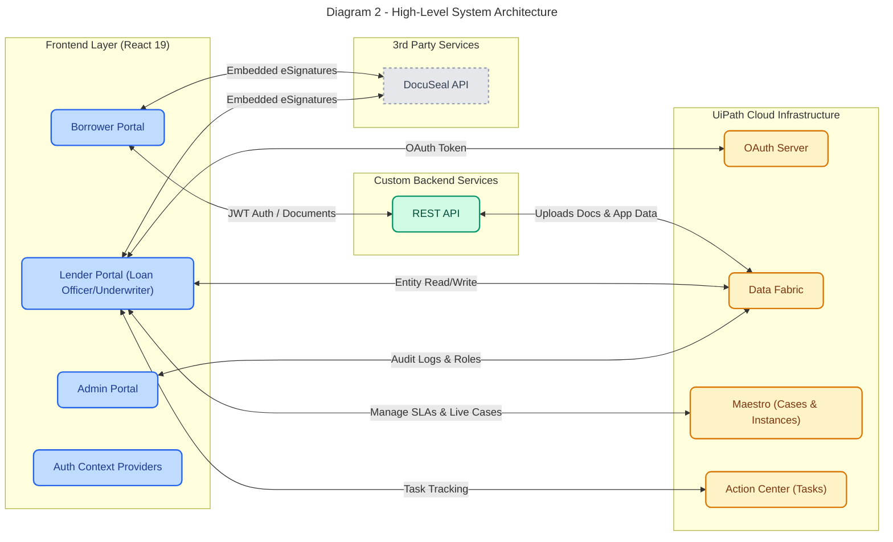
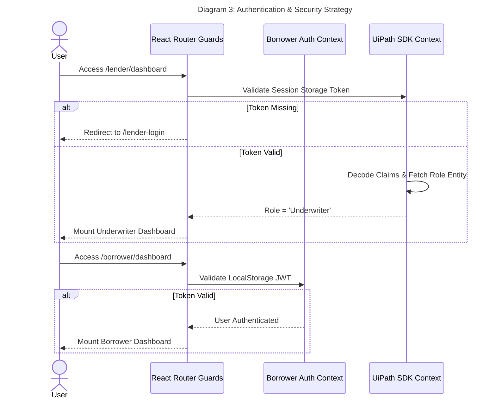
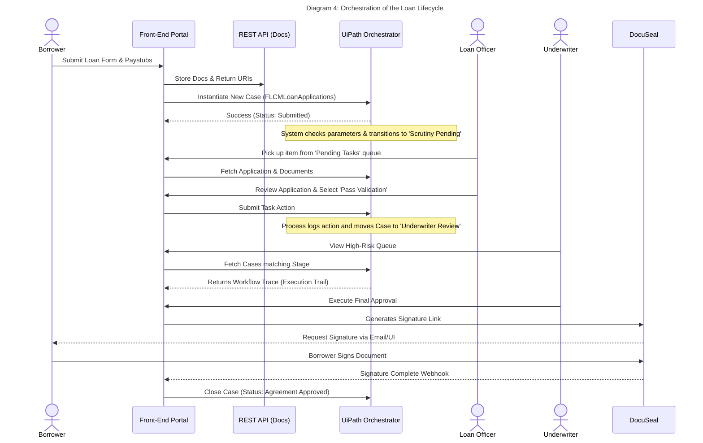

# Solution & Architecture Design
**Project:** Financial Lending Portal
**Version:** 1.0

---

## 1. Executive Summary

This document describes the solution architecture of the Financial Lending Portal. The system is designed to provide a unified, automated, and secure lending experience across multiple distinct user personas (Borrower, Admin, Loan Officer, Underwriter). It bridges traditional web-based REST principles with modern Robotic Process Automation (RPA) orchestration powered by UiPath.

### The Role-Based Command Center
Overall, the Lender Portal (for Loan Officers and Underwriters) acts as the operational heartbeat of the application. For business users, the app serves as a role-based command center where they can:
- **Monitor live cases** and application state.
- **Manage tasks** and underwriting validation workflows.
- **Manage SLAs** and execution speeds.
- **View a clear, auditable timeline** of everything that has occurred natively via the Execution Trail.

---

## 2. System Context

This diagram illustrates the portal's position in the broader ecosystem, identifying the primary actors, the main web portal, and the external systems it depends on.

---

## 3. High-Level System Architecture

The ecosystem relies on an event-driven and API-driven hybrid architecture. The diagram below details how specific frontend chunks talk directly to their respective backend integrations based on their operational domains.

### Key Components
1.  **Frontend Layer**: Built using React 19, TypeScript, and Vite. Leverages `react-router-dom` for strict RBAC routing and extensive code-splitting for performance.
2.  **Custom REST Backend**: Specifically serves the Borrower Portal (registration, application intake, and document uploads). It communicates directly with UiPath Data Fabric. **All application data and documents are stored exclusively in Data Fabric** (no independent databases).
3.  **UiPath Cloud Ecosystem**: The "brain" of the operation for staff personas. **Maestro** manages live cases, SLAs, and case progress tracking. **Action Center** handles human-in-the-loop task state progression, while centralized schemas (like `FLCMLoanApplications`) are stored in the Data Service.
4.  **DocuSeal**: Injected as an iframe/SDK for securely gathering digital signatures compliant with financial regulations.

---

## 4. Authentication & Security Model

The system employs a dual-authentication topology to ensure perfect segregation of privileges between clients (borrowers) and internal staff.

### Security Measures:
*   **Borrower Isolation**: Borrowers use standard JWTs, ensuring they absolutely cannot execute UiPath SDK functions.
*   **Role-Based Access Control (RBAC)**: Enforced hierarchically by `<ProtectedRoute>` wrappers that cross-reference the user's fetched role against allowed routes.

---

## 5. Integration Workflow: The Loan Lifecycle

This sequence outlines the journey of an application starting from initial validation up to contractual digital signature. This mapping ensures that human intervention stages (like Loan Officer Validation) happen consistently alongside system automation.

---

## 6. Optimization & Technical Debt Considerations

*   **Dynamic Code Splitting**: All major dashboards are wrapped in React `Suspense` and dynamically imported. Heavy libraries like Recharts and the UiPath SDK are segmented into manual Webpack chunks via Vite (`manualChunks`), dramatically reducing the initial JS payload.
*   **Field Normalization Risk**: Due to disparate DB and UiPath Data Service definitions, UI adapters proactively map mixed-casing fields (e.g., `loanAmount` vs `LoanAmount`) dynamically.
*   **SLA Compliance Service**: Designed into the Underwriter dashboard logic, evaluating timestamps directly from `CaseInstances` to generate real-time escalation warnings.
